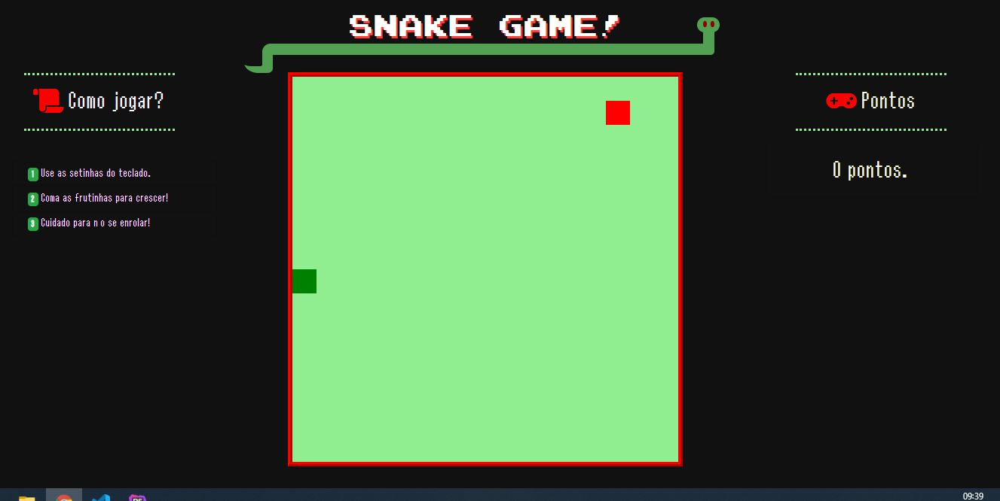
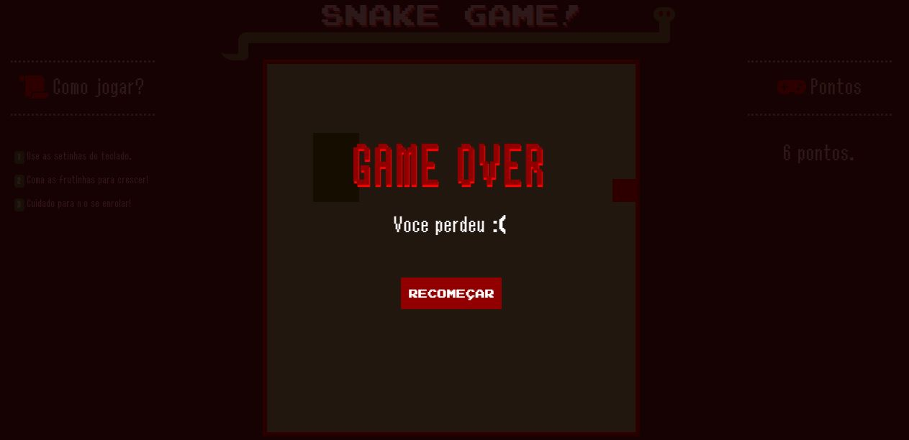

# :snake: Snake Game

* [Português](https://github.com/gloriaporte/dio_snakegame_javascript/#sobre)
* [Englishs](https://github.com/gloriaporte/dio_snakegame_javascript/#about)

## :information_source: Sobre

Um projeto prático da Digital Innovation One recriando o jogo da cobrinha, com pontuação e tela de game over, feito com: 
* HTML5.
* CSS3.
* Canvas.
* Javascript.

[Acesse o projeto.](https://gloriaporte.github.io/dio_snakegame_javascript)

____________________________________

## :information_source: About

This is a Digital Innovation One project of recreating snakegame, with points and game over screen using:
* HTML5.
* CSS3.
* Canvas.
* Javascript.

[Acess the project.](https://gloriaporte.github.io/dio_snakegame_javascript)

